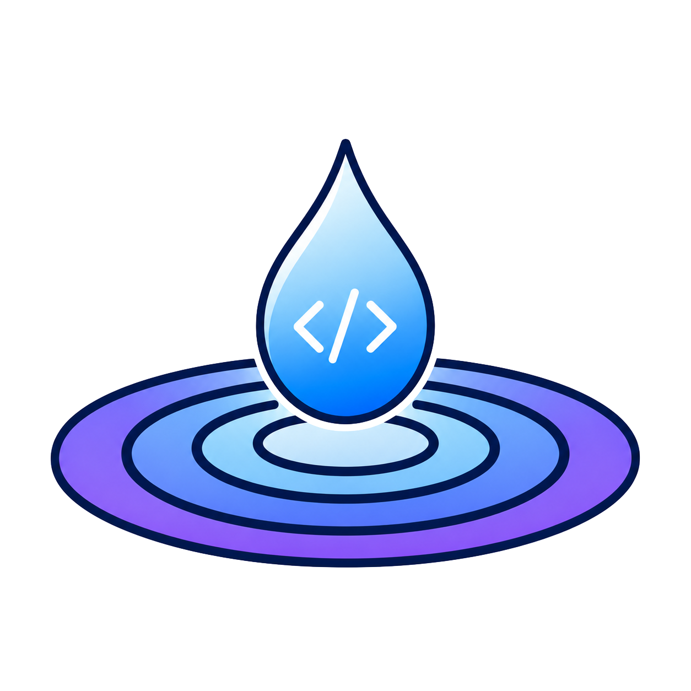

<div class="hero" markdown>



# Ripple

<p class="tagline">An on-device coding agent for your terminal, built on the Apple stack: local models with Apple MLX and an Apple Container sandbox (remote models supported too).</p>

[Get started](getting-started/installation.md){ .md-button .md-button--primary }
[View on GitHub](https://github.com/dsaad68/ripple){ .md-button }

</div>

Ripple is a terminal-native coding agent for macOS, in the same spirit as Claude Code - it reads
your project, plans, edits files, and runs commands, with you approving each step. The difference
is that the planner runs **on your Mac**, not in the cloud: Ripple is built on the
[DeepAgents](https://github.com/dsaad68/deepagents-swift) Swift framework and runs models on-device
through Apple's MLX, starting with LiquidAI's LFM2.5 family and expanding to more on-device models
over time. Agent shell commands can run inside an isolated [Apple Container](https://github.com/apple/container) sandbox, keeping file changes off your machine. The same agent also has a **headless mode** (`ripple -p`) for
scripts, CI, and editor keybindings, and can drive remote models (OpenAI, Anthropic, OpenRouter,
Bedrock) when you want them.

## Explore the docs

<div class="grid cards" markdown>

-   :material-rocket-launch-outline: **[Getting started](getting-started/installation.md)**

    Install with Homebrew, pre-fetch a model, and run your first prompt.

-   :material-console-line: **[Interactive chat](chat/index.md)**

    The `ripple chat` REPL/TUI - slash commands, `@` mentions, approvals, the plan panel, and keys.

-   :material-chip: **[Models](models/index.md)**

    On-device MLX models and remote OpenAI-compatible providers; how a planner is selected.

-   :material-cog-outline: **[Configuration](config/index.md)**

    `~/.ripple` and project `.ripple` settings, tool policy, sessions, and context compaction.

-   :material-server-network: **[MCP servers](mcp.md)**

    Connect Model Context Protocol servers over HTTP, SSE, or stdio, with per-server approval.

-   :material-shield-lock-outline: **[Sandbox & shell](sandbox.md)**

    Run agent shell commands inside an Apple Container sandbox; `!` vs `!!` targets.

-   :material-flask-outline: **[Scenario harness](scenarios.md)**

    `ripple run` - headless, reproducible scenario files with fixtures and expected signatures.

-   :material-book-open-variant: **[Reference](reference/commands.md)**

    Full command, flag, and slash-command reference.

</div>

## Highlights

<div class="grid cards" markdown>

- :material-laptop: __On-device by default__

    Run LLMs entirely on your Mac. No API key required, nothing leaves your machine. Powered by Apple's MLX on Apple Silicon.

- :material-console: __Interactive REPL / TUI__

    `ripple chat` opens a full terminal UI with a live transcript, pinned plan panel, context meter, markdown rendering, and syntax-highlighted code.

- :material-cloud-outline: __Remote models too__

    Register any OpenAI-compatible endpoint - OpenAI, Anthropic, Azure OpenAI, AWS Bedrock, or OpenRouter - and switch between local and remote planners mid-session.

- :material-server-network: __MCP servers__

    Connect any Model Context Protocol server (HTTP, SSE, or stdio), per-project or globally. MCP tools join the agent and appear in `/mcp` and `/tools`.

- :material-shield-lock: __Sandboxed shell__

    Agent shell calls can run inside an [Apple Container](https://github.com/apple/container) (OCI) sandbox. `!cmd` targets the container; `!!cmd` targets your local shell.

- :material-hand-okay: __Approvals & permission modes__

    Every gated tool call shows an approval card. Press ++tab++ to cycle four permission modes - ask, auto-reads, plan (dry run), and accept-all - without leaving the input line.

- :material-content-save-all: __Sessions & resume__

    Every conversation is persisted automatically. `ripple --resume` picks up any past session for the current project, exactly where you left off.

- :material-file-code: __Headless & scriptable__

    `ripple -p "..."` runs a one-shot prompt and exits; `--output-format json` makes the output easy to parse. Wire it into CI, shell scripts, or editor keybindings.

</div>

## A `ripple chat` session in practice

```text
$ cd ~/projects/my-app
$ ripple chat --model LiquidAI/LFM2.5-1.2B-Instruct-MLX-bf16

  Ripple  LFM2.5-1.2B  ask   ~/projects/my-app

> Refactor the networking layer to use async/await

  Thinking...
  ✓ Thought for 3s

  Plan
  ├─ [ ] Read existing NetworkManager.swift
  ├─ [ ] Identify callback-based APIs
  ├─ [ ] Rewrite with async/await
  └─ [ ] Update call sites

  read_file("Sources/NetworkManager.swift")
  ┌─ Approve / Reject / Always-allow ──────────────┐
  │  a approve   r reject   A always-allow          │
  └────────────────────────────────────────────────┘

a

  [reads file, plans edits, writes back]

  Done. Converted 4 callback-based methods to async/await ...
```

The agent reads context, builds a plan, calls tools (with your approval), and streams its answer -
all inside the terminal, all on-device.

## Requirements

| Requirement | Version |
|---|---|
| macOS | 26+ (Tahoe) |
| Architecture | Apple Silicon (arm64) |
| Xcode | 26+ (to build from source) |
| Swift | 6.1+ |

!!! info "Why Xcode 26?"
    Ripple uses MLX, which ships Metal shader code. Only Xcode's `xcodebuild` emits the
    `default.metallib` that MLX needs at runtime. A plain `swift build` produces a binary that
    crashes on the first model generation. See [Installation](getting-started/installation.md).
